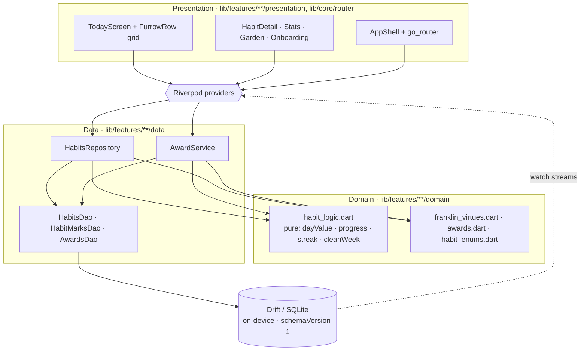
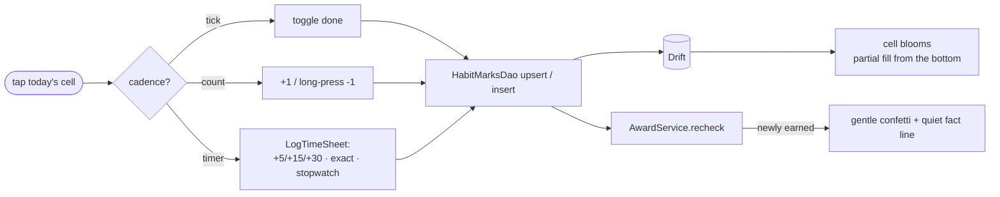
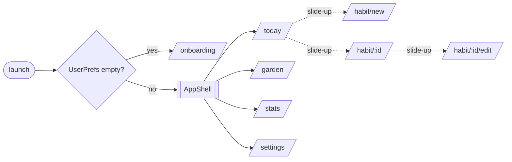
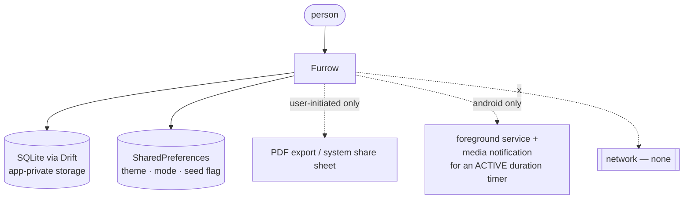
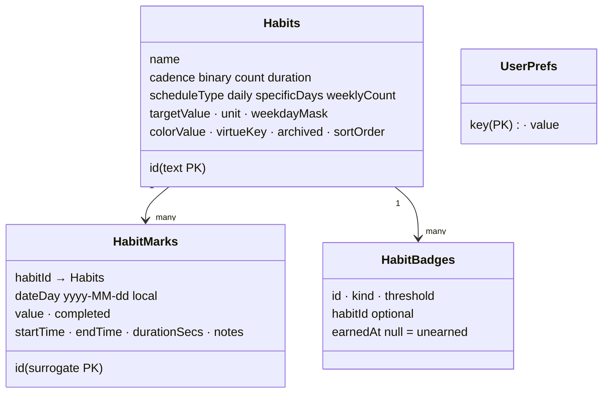

# Architecture Overview

> The one-page mental model of Furrow, then the diagrams that make it concrete.
> For *why* each load-bearing decision was made, see [`docs/adr/`](../adr/). For
> the exact data shapes, see [`docs/reference/`](../reference/).

## What this is, in one paragraph

Furrow is a **single-user, local-first** Flutter app. It follows Clean
Architecture per feature: a **domain** layer of pure functions and entities, a
**data** layer of Drift DAOs and repositories over an on-device SQLite database,
and a **presentation** layer of screens and widgets driven by Riverpod
providers. There is no server, no network layer, no account. The signature
surface is the **Today grid** — one habit per row, seven inked day-cells per
row — and everything else (Habit Detail, Stats, awards, onboarding) hangs off the
same small domain of *habits* and *marks*.

## The layers (the single most important picture)

Read this and you understand 80% of the codebase: data flows down through
providers to pure logic and Drift, and back up as reactive streams.

Two facts to hold onto:

1. **The domain is pure and has no dependencies downward.** `habit_logic.dart`
   imports the Drift row types but touches no database and no widgets — it is
   plain functions over data, so it is trivially unit-testable. Keep it that way.
2. **State is reactive, not fetched.** Widgets `watch` Riverpod providers that
   expose Drift `watch` streams; a write to the DB re-emits and the UI rebuilds.
   No manual refresh, no imperative reloads.

## The core interaction: marking a day

The one loop the whole app is built around — tap a cell on the Today grid.

- **Binary/count** marks are *upserted* keyed on `(habitId, dateDay)` — one row
  per day. **Duration** marks are *inserted* as many session rows per day, and
  the day's completion is derived (`SUM(durationSecs) ≥ target`).
- **Partial bloom**: a cell fills proportionally to `dayProgress` (a min visible
  sliver of 0.18) so a single tap registers immediately instead of staying blank
  until the whole target lands. See [ADR-0006](../adr/0006-three-cadences-one-table.md).
- **Awards re-check after every mark** and are earned once, permanently.

## Navigation & app shell

`go_router` drives navigation. A `ShellRoute` wraps the four primary tabs; habit
create/detail/edit push as slide-up sheets over the shell.

The Today screen has two display **modes** toggled by a pill: **Flow** (the
default — the clean FurrowRow grid) and **Rich** (a denser view). Both read the
same habits and marks.

## Where it sits (system context)

Furrow is a leaf: it talks to the device, and nothing else.

- There is **no network layer**. The shipped Android build declares no `INTERNET`
  permission. PDF export and the share sheet are local and user-initiated. See
  [privacy model](../privacy-model.md).
- The only notification Furrow posts is the transient one that keeps a running
  **duration timer** alive as an Android foreground service — never an engagement
  nudge. ([ADR-0007](../adr/0007-no-dark-patterns.md))

## The data model (what you're storing)

Full column detail in [reference/data-model.md](../reference/data-model.md). The
schema is `schemaVersion 1` with a clean `onCreate` — no migrations yet.

## Module map (where to look)

| Concern | Modules |
|---|---|
| **Pure domain logic** | `lib/features/habits/domain/` — `habit_logic.dart`, `awards.dart`, `franklin_virtues.dart`, `habit_enums.dart` |
| **Storage / schema** | `lib/core/storage/app_database.dart` (Drift tables + seed) |
| **Data access** | `lib/features/habits/data/` — `habits_repository.dart`, `habits_dao.dart`, `habit_marks_dao.dart`, `awards_dao.dart`, `award_service.dart` |
| **Signature UI** | `lib/features/habits/presentation/furrow_row.dart`, `today_screen.dart` |
| **Other screens** | `.../presentation/` — `habit_detail_screen.dart`, `stats_screen.dart`, `garden_screen.dart`, `log_time_sheet.dart`, `habit_edit_sheet.dart`; `lib/features/onboarding/` |
| **Navigation** | `lib/core/router/app_router.dart`, `app_shell.dart` |
| **Auth (ghost)** | `lib/core/auth/` — `ghost_auth_repository.dart`, `auth_state.dart` |
| **Settings / prefs** | `lib/features/settings/`, `lib/shared/widgets/mode_pill.dart` |
| **Theme** | `lib/shared/theme/` — `app_colors.dart`, `app_theme.dart`, `app_text_styles.dart`, `app_spacing.dart` |
| **Shared helpers** | `lib/shared/extensions/` (`datetime_ext.dart`, `duration_ext.dart`), `lib/shared/widgets/` |
| **App entry / web** | `lib/main.dart`, `web/index.html`, `web/manifest.json` |

## Invariants that must always hold

Breaking one is a design regression, not a feature (see [VISION.md](../VISION.md)
and [docs/adr/](../adr/)):

1. **Local-first, offline, no network.** No egress; shipped Android build has no
   `INTERNET` permission.
2. **No account for core use.** Ghost mode is the product.
3. **Calm, not engaging.** Streaks never red, silent reset, no punitive nudges,
   raw-count stats.
4. **Pure domain.** Habit/streak/award math stays free of DB and widgets.
